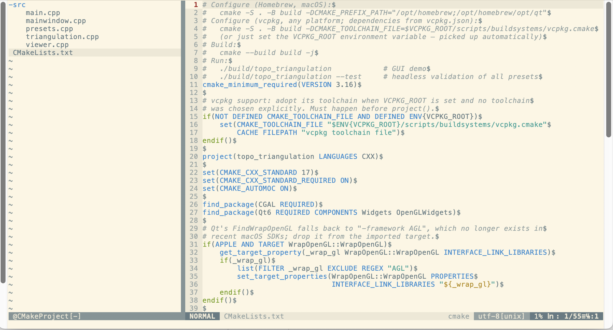

VIM-CMake-Project
=================

CMake project management plugin for the VIM editor. It provides a sidebar
showing your project's files in a tree view, built from what CMake actually
knows about the project rather than from a directory scan.

[](screenshot.png)

Breaking changes in 3.0
-----------------------

Version 3.0 is a rewrite. See `:help cmake-project-upgrading` for the details.

* **`<Space>` is no longer a global mapping.** It is now buffer-local to the
  sidebar. The old `map <Space>` was recursive and applied in normal, visual,
  select and operator-pending mode in every buffer, so it broke things like
  `d<Space>` editor-wide. To get a global key, bind one of the `<Plug>`
  mappings yourself.
* **Python is no longer required.** 2.x needed a Vim built with the Python 2
  interface, which no current Vim provides and Neovim never had. 3.0 is pure
  Vim script and works on both editors.
* **The data source changed** from the deprecated `CodeBlocks - Unix
  Makefiles` generator to the CMake File API, so any generator works. What the
  sidebar lists changed slightly as a result — see
  `:help cmake-project-limitations`.

Requirements
------------

* Vim 8.1 or newer, or any Neovim
* CMake 3.14 or newer

Installing
----------

With [vim-plug](https://github.com/junegunn/vim-plug):

```vim
Plug 'Ignotus/cmake-project.vim'
```

With [lazy.nvim](https://github.com/folke/lazy.nvim):

```lua
{ 'Ignotus/cmake-project.vim', cmd = { 'CMakeGen', 'CMakeBar' } }
```

With [packer.nvim](https://github.com/wbthomason/packer.nvim):

```lua
use 'Ignotus/cmake-project.vim'
```

With Vim's built-in package support:

```sh
git clone https://github.com/Ignotus/cmake-project.vim \
    ~/.vim/pack/plugins/start/cmake-project.vim
```

Or from a checkout:

```sh
make install          # specify DESTDIR to install elsewhere; default is ~/.vim
```

Quick start
-----------

Start Vim in the directory holding your top-level `CMakeLists.txt`:

```vim
:CMakeGen build       " configure, then load
:CMakeBar             " open the sidebar
```

Press `<Space>` over a directory to fold it, or over a file to open it. Extra
arguments go straight to cmake:

```vim
:CMakeGen build -G Ninja -DCMAKE_BUILD_TYPE=Debug
```

Commands
--------

| Command | Description |
| --- | --- |
| `:CMakeGen [dir] [cmake args...]` | Configure with cmake and load the result |
| `:CMakeLoad [dir]` | Load an existing build tree without running cmake |
| `:CMakeRefresh` | Reload the remembered build directory |
| `:CMakeBar` | Open the sidebar |
| `:CMakeBarClose` / `:CMakeBarToggle` | Close / toggle the sidebar |
| `:CMakeOutput` | Show the last cmake invocation and its output |

`:CMakeLoad` also reads build trees configured by other tools, such as
`cmake --preset`, CLion or VS Code.

Options
-------

| Variable | Default | Description |
| --- | --- | --- |
| `g:cmake_project_show_bar` | `0` | Open the sidebar on startup |
| `g:cmake_project_bar_width` | `40` | Sidebar width in columns |
| `g:cmake_project_folder_open_symbol` | `'-'` | Marker for an expanded directory |
| `g:cmake_project_folder_close_symbol` | `'+'` | Marker for a collapsed directory |
| `g:cmake_project_no_mappings` | `0` | Suppress the sidebar's mappings |
| `g:cmake_project_cmake_program` | `'cmake'` | The cmake executable to run |

Development
-----------

```sh
make test               # vader.vim is cloned into .deps/ on first run
make test EDITOR_BIN=nvim
make lint               # requires vim-vint
```

Tests run against checked-in CMake File API fixtures and need no cmake; the
integration suite self-skips when cmake is unavailable.

License
-------

This product is released under the [MIT License](LICENSE).
